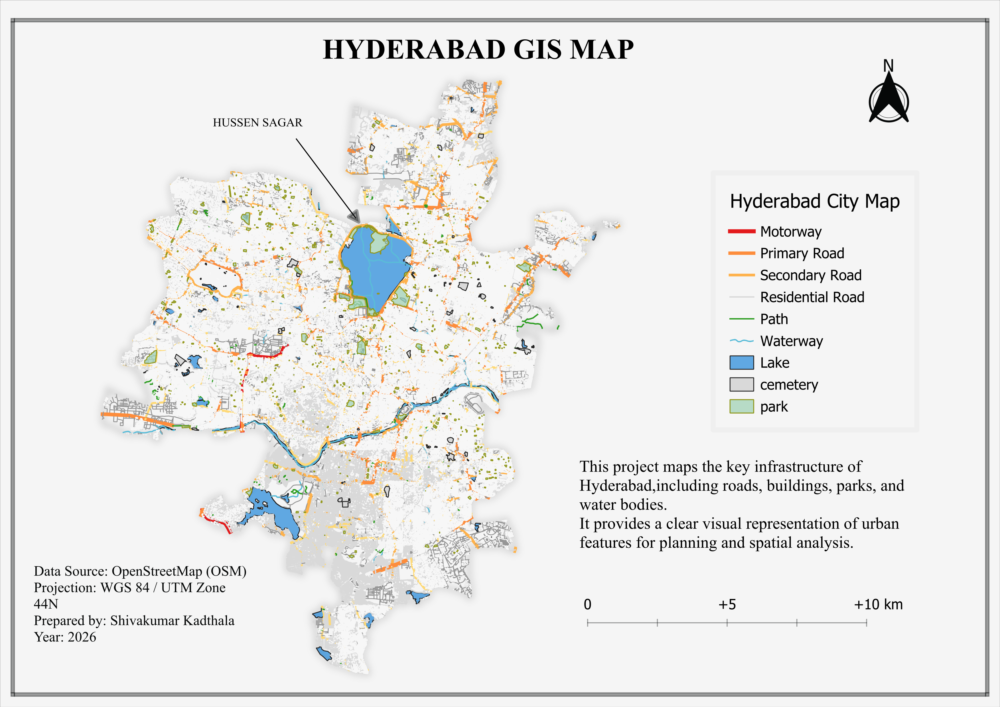

# Hyderabad GIS Map 🗺️

This project presents a detailed Geographic Information System (GIS) map of Hyderabad city. 
The map visualizes key urban infrastructure and spatial features using OpenStreetMap (OSM) data.

## Project Overview
The purpose of this project is to represent the spatial structure of Hyderabad by mapping major transportation networks, water bodies, and urban land features. The map provides a clear cartographic representation useful for spatial analysis and urban planning.

## Features Mapped
- Motorways
- Primary Roads
- Secondary Roads
- Residential Roads
- Pathways
- Waterways
- Lakes
- Parks
- Cemeteries

## Data Source
OpenStreetMap (OSM)

## Projection
WGS 84 / UTM Zone 44N

## Tools Used
- QGIS
- OpenStreetMap Data
- GIS Cartography
- Spatial Data Processing

## Map Elements
- Legend
- North Arrow
- Scale Bar
- Cartographic Layout

## Author
Shiva kumar Kadthala

## Year
2026
